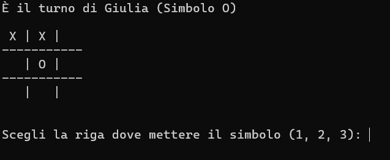
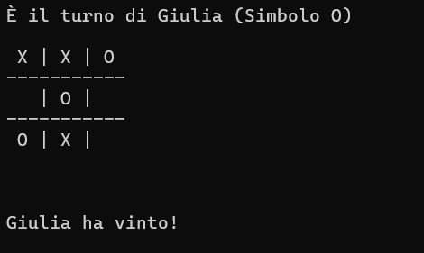
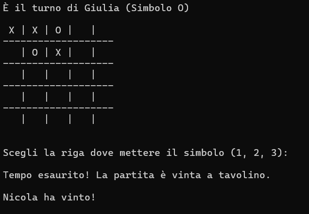

# Tris with Shared Memory and Semaphores

**SystemV-Tris** is a terminal-based implementation of the classic **Tic-Tac-Toe** game (also known as "Tris"), built in C using **System V IPC mechanisms**. It supports two human players competing in real time on Unix/Linux systems. The server manages shared memory, semaphores, and process communication, while the clients handle user interaction and rendering of the game board. The game supports variable-sized square grids (e.g. 3x3, 4x4, ..., NxN), with victory conditions adapting accordingly (N symbols aligned).

# Table of Contents
- [Tris with Shared Memory and Semaphores](#tris-with-shared-memory-and-semaphores)
  - [Features](#features)
  - [Technologies Used](#technologies-used)
  - [How It Works](#how-it-works)
    - [TriServer](#-trisserver)
      - [Build Instructions (Linux)](#build-instructions-linux)
      - [Usage](#usage)
    - [TriClient](#triclinet)
  - [Notes](#notes)
  - [Screenshots](#screenshots)

## Features
- Local multiplayer game using shared memory
- Turn-based logic synchronized with semaphores
- Win detection (horizontal, vertical, diagonal)
- Timeout for moves (optional)
- Graceful termination on `CTRL-C` with IPC cleanup
- Asynchronous communication between server and clients
- Support for custom symbols per player

## Technologies Used
This project demonstrates low-level interprocess communication using:
- Shared memory
- Semaphores
- Process creation and concurrent arbitration
- Signal handling

## How It Works
The system consists of **two executables**:

### TriServer
Launches the game, initializes IPC, and manages the game loop. Three semaphores are used to control the game flow in the order: Client1 → Server → Client2 → Server → ...

#### Build Instructions (Linux)
<pre>gcc TriServer.c -o TriServer
gcc TriClient.c -o TriClient</pre>

#### Usage:
<pre>bash
./TriServer <timeout> <symbol1> <symbol2>

Example:
./TriServer 10 O X</pre>

timeout: Max time in seconds for each player to make a move (0 = no timeout).
symbol1, symbol2: Custom symbols for each player.

The server:
- Initializes shared memory and semaphores.
- Creates two child processes (clients).
- Alternates turns using semaphores.
- Validates moves and checks for a winner via checkTris() and checkLine().
- Handles SIGINT for graceful shutdown, notifying clients and releasing resources.

### TriClient
Is automatically launched by the server.

Each client:
- Connects to shared memory and semaphores.
- Waits for its turn via semaphore signaling.
- Displays the current game board.
- Accepts user input (row and column).
- Validates move legality.
- Sends control back to the server.

If CTRL-C is pressed:
- The client notifies the server of early exit.
- The server awards the match to the remaining player.

## Notes
- If a player fails to make a move within the timeout, the game is awarded to the other player.
- Game ends automatically on full board or if a client disconnects.
- Server automatically cleans up IPC resources on shutdown.

## Screenshots

